# Entrada 04 — Resumen del primer IRAT

## Contexto
Realicé un resumen para el primer IRAT del curso; esto me permitió afianzar mis conocimientos
de una mejor manera, aprendiendo sobre la introducción a *machine learning* y en qué se basan los modelos de *machine learning*.

## Objetivos
- Poder comprender el concepto de *Predictive Modeling*.
- Comprender qué significa el concepto de algoritmos paramétricos y cuándo es conveniente utilizarlos.
- Comprender qué significa el concepto de algoritmos no paramétricos y cuándo es conveniente utilizarlos.
- Comprender el concepto de *overfitting* y *underfitting*.
- Comprender las técnicas para prevenir el *overfitting*.
- Comprender el concepto de *machine learning* supervisado, semi-supervisado vs. no supervisado.
- Comprender el concepto de *Clustering* y *Association* en *machine learning* no supervisado.
- Entender la diferencia entre *low bias* y *high bias*.
- Entender el *variance error*.

## Actividades (con tiempos estimados)
- Leer y analizar las lecturas — 1 hora y media.
- Realizar un resumen de las lecturas.

## Desarrollo

Procedo a adjuntar el resumen del IRAT:

**IRAT I IA:**

*Predictive modeling:* subfield of machine learning focused on making predictions.

f = *target function*  
y = *output value*, el *output* que va a devolver el modelo.  
y = f(x) + e  
x = *input data*, parámetros que le pasamos al modelo.  
e = *irreducible error*, no importa qué tan cerca lleguemos de estimar la *target function*, nunca vamos a poder reducir este error. e es independiente de X.

*Predictive modelling*, Y = f(x): hacemos predicciones de Y para un nuevo x; nuestro objetivo es realizar la predicción más acertada de y dado un x.

No estamos interesados en la forma de la función f; solo queremos que haga predicciones acertadas.

Podríamos aprender el mapeo de y = f(x) para aprender más acerca de las relaciones de los datos; esto se llama **estadística inferencial**.

**Parametric Algorithm** = simplifican f a una forma conocida; el número de parámetros a estimar es fijo, independiente de la cantidad de datos.

**Parametric Model** = modelo de aprendizaje que resume datos, con una cantidad de parámetros de longitud fija (independientemente del número de ejemplos entrenados). Siempre la cantidad de parámetros a estimar va a ser p + 1, siendo p la cantidad de columnas de los datos que le pasamos al algoritmo y 1 = b0, o sea *bias* (error de intercepto).

.png)

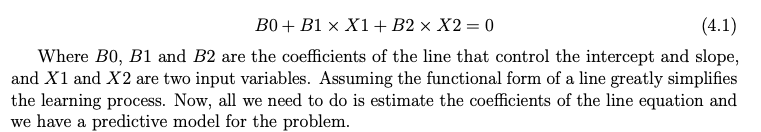

B0, B1, B2 = coeficientes de la línea  
X1, X2 = *input variables*

Los algoritmos paramétricos son utilizados en regresión lineal; para tener un modelo predictivo lo que tenemos que hacer es estimar los coeficientes de la función.

Ejemplos de *parametric machine learning algorithms* pueden ser:

- *Logistic Regression*
- *Linear Discriminant Analysis*
- *Perceptron*

**Parametric Machine Learning Algorithms Benefits vs. Limitations:**

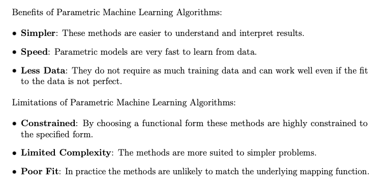

**NonParametric Machine Learning Algorithms:**

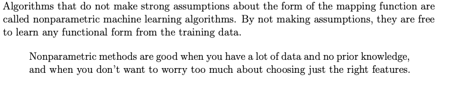

**Examples of NonParametric Machine Learning Algorithms:**

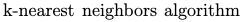

**NonParametric Machine Learning Algorithms Benefits vs. Limitations:**

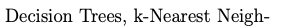

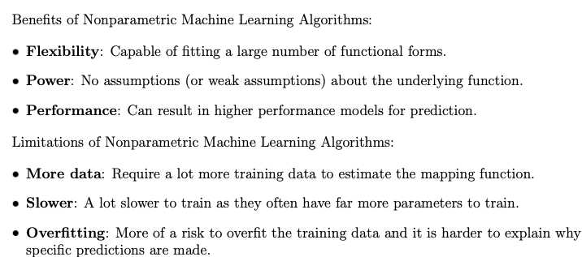

**Overfitting = sobreajuste**

**Supervised Machine Learning:**

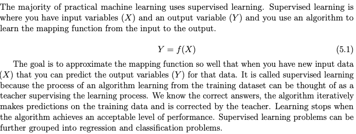

**Classification vs Regression:**

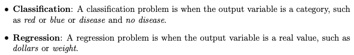

**Commons types of problem that are Supervised Machine Learning:**

**Unsupervised Machine Learning:**

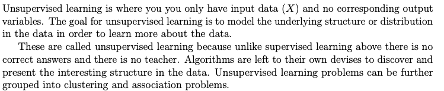

**Types of Unsupervised Machine Learning, Clustering vs Association:**

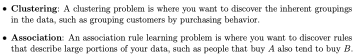

**Examples of Unsupervised Machine Learning Algorithms:**

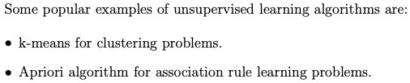

**SemiSupervised Machine Learning**

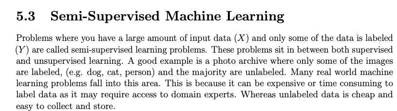

*Unlabeled Data* = datos no etiquetados; básicamente, datos que a priori no tenemos información que los corresponda con ningún Y (o sea, con algún parámetro pasado al algoritmo, columna).

**Prediction Errors, 3 parts:**

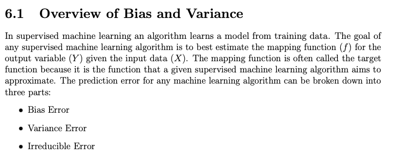

**Irreducible Error:**

 4.16.50 p. m..png)

**Bias Error:**

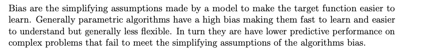

**Low Bias:**

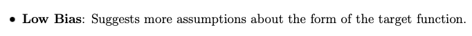

**Examples:**

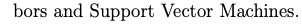

**Variance Error:**

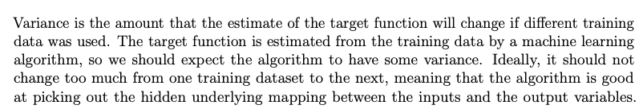

**Low Variance:**

**Examples:**

 4.34.54 p. m..png)

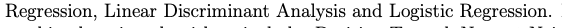

**High Variance:**

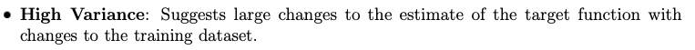

Algorithms that have a high flexibility (they make fewer assumptions on the target function, not approximating the target function to a known form) have HIGH bias.

**Examples:**

**Examples of how to treat the BIAS - VARIANCE TRADE OFF:**

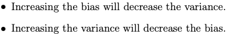

**Overfitting (sobreajuste, sobrentrenamiento):**

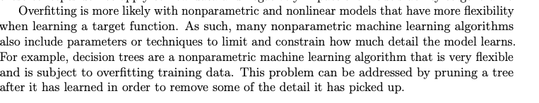

**Prunning a tree:**

Pruning un árbol (poda de un árbol de decisión) significa recortar ramas del árbol para que el modelo no sea tan complejo y no se quede memorizando detalles irrelevantes del *dataset* de entrenamiento.

**Tecniques to limit overfitting:**

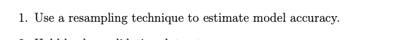

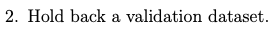

**Resampling vs Holding a Validation dataset:**

Resampling (*k*-fold cross validation)  
* Idea: dividir tu *dataset* en *k* partes.  
* Cada vez entrenás el modelo con *k-1* partes y lo probás con la parte que quedó afuera.  
* Repetís este proceso *k* veces, cambiando cuál parte queda afuera.  
* Así obtenés *k* estimaciones de rendimiento, y el promedio es un estimador más robusto de cómo funcionará el modelo con datos nuevos.  
* Ventaja: usás todos los datos tanto para entrenar como para validar, en diferentes momentos.

2. *Validation dataset*  
* Idea: separar desde el principio una parte del *dataset* (no se usa en el entrenamiento).  
* Entrenás y tunéas el modelo con el resto.  
* Al final, lo probás en este *dataset* reservado, para tener una evaluación “honesta” del desempeño real.  
* Ventaja: simula mejor el escenario de datos realmente nuevos.

**Diferencia clave**  
* *Cross validation*: sirve para elegir y ajustar el modelo (estimación interna).  
* *Validation dataset*: sirve para la evaluación final (medir lo que podría pasar en producción).

**Underfitting:**

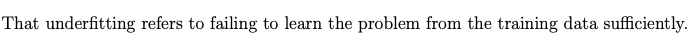

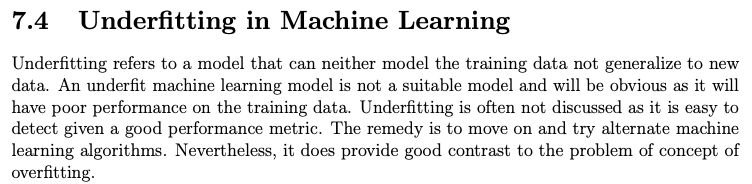

**Inductive Learning:**

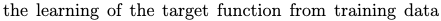

**Generalization:**

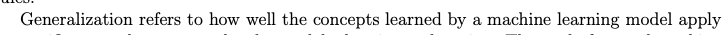

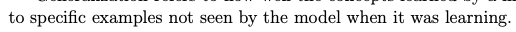

All the machine learning models want to have the best possible generalization.

## Evidencias
- Enlace a material o capturas en `docs/assets/`.

## Reflexión
Considero que lo más desafiante fue entender cuándo es conveniente utilizar los algoritmos paramétricos, ya que
son más rápidos al simplificar f a una forma conocida, pero rara vez aciertan la predicción de la función f,
por lo que resultan menos eficientes. También el hecho de cómo manejar *unlabeled data*, ya que no tenemos información
que los relacione a ninguno de los atributos del *dataset*. También me pareció muy interesante el concepto de *overfitting*, ya
que es algo que nos puede pasar y que entiendo que en la industria puede costar mucho dinero revertir; por ello
considero que es valioso entender el concepto y las técnicas para prevenirlo.

## Próximos pasos
Procedí a realizar la tarea 4 y posteriormente realicé los cursos en Kaggle de *Data Visualization*, *Intro to Machine Learning* e
*Intermediate Machine Learning*.
