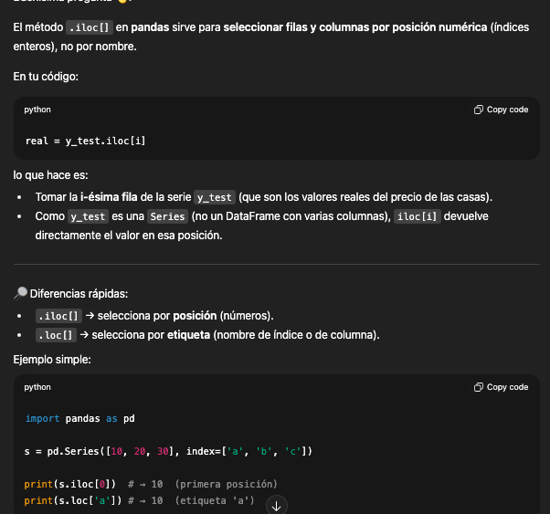
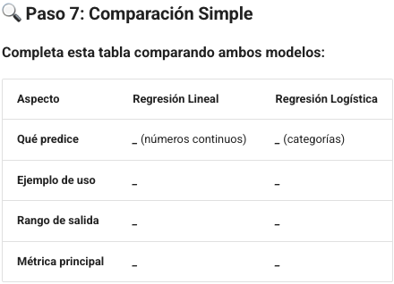

# Entrada 05 — Cuarto trabajo práctico~~
~~

## Contexto
En esta ocasión trabajamos con dos de los modelos más utilizados en machine learning clásico: regresión lineal y regresión logística. A través de un enfoque guiado, aplicamos regresión lineal para predecir precios de casas en Boston y regresión logística para clasificar tipos de tumores en benignos o malignos, entendiendo tanto su implementación como sus métricas de evaluación.

## Objetivos
- Comprender las diferencias conceptuales entre regresión lineal y regresión logística.
- Entender paso a paso la implementación guiada de un modelo de regresión lineal para predicción de valores continuos.
- Entender paso a paso la implementación de un modelo de regresión logística para clasificación binaria.
- Familiarizarse con las principales métricas de regresión (MAE, MSE, RMSE, R², MAPE).
- Aprender a evaluar un modelo de clasificación mediante accuracy, precision, recall, F1-score y matriz de confusión.
- Desarrollar criterio para seleccionar el modelo adecuado según el tipo de problema.

## Actividades (con tiempos estimados)
- Exploración inicial de datasets (Boston Housing y Breast Cancer) — 20 min  
- Implementación de regresión lineal y cálculo de métricas — 40 min  
- Implementación de regresión logística y cálculo de métricas — 40 min  
- Comparación de ambos modelos en tabla comparativa — 20 min  
- Respuesta a preguntas de reflexión final — 30 min  

## Desarrollo
Primero procedí a realizar la exploración de los datos de cada dataset, para así comprender de mejor manera con qué tipos de datos estábamos trabajando.  
Luego realicé un repaso de los conceptos de regresión lineal y regresión logística, y cuándo debemos utilizar cada uno de estos modelos, teniendo en cuenta siempre el contexto de negocio y el problema que queremos resolver.

Después seguí paso a paso la consigna de la tarea, apoyándome en el código brindado por el profesor.  
A medida que iba realizando el ejercicio, anotaba los métodos de Python que no conocía o no recordaba.

Por último, respondí las preguntas planteadas.

Procedo a adjuntar las preguntas del trabajo práctico:

IA I Tarea 4:

### Regresión Lineal

Caso de negocio:
* Problema: Una inmobiliaria de Boston necesita estimar precios de propiedades automáticamente.  
* Objetivo: Predecir el valor medio de casas (en miles de USD) basado en características del barrio.  
* Variables: 13 características como criminalidad, zonas industriales, acceso a autopistas, etc.  
* Valor para el negocio: Automatizar valuaciones, optimizar inversiones inmobiliarias.  

* 💭 ¿Cuál columna contiene los precios que queremos predecir?  
	Medv  

* 📖 Busca en internet: "boston housing dataset target variable".

Biblioteca sklearn ML:

- `modelo.fit()` = Se encarga de entrenar al modelo.  
- `modelo.predict()` = Realiza las predicciones.  

`.iloc[]` vs `.loc[]`  

💡 PISTAS:  
* 🤖 ¿Qué clase de sklearn se usa para regresión lineal?  
	El método de sklearn que se utiliza para regresión lineal es `LinearRegression`.  
* 📚 ¿Cuál método entrena un modelo?  
	El método que entrena un modelo es `.fit()`.  
* 🔮 ¿Cuál método hace predicciones?  
	El método que hace predicciones de un modelo es `.predict()`.  

📊 Métricas: `mean_absolute_error`, `mean_squared_error`, `r2_score`.  

BONUS: ¿Qué significan estas métricas?  
1. **MAE (Mean Absolute Error):** Promedio del valor absoluto de los errores, lo que hace que no importe si son positivos o negativos.  
2. **MSE (Mean Squared Error):** Promedio de los errores al cuadrado, penaliza más los errores grandes.  
3. **RMSE:** Raíz cuadrada del MSE, vuelve a las mismas unidades originales del problema.  
4. **R²:** Indica qué porcentaje de la variabilidad de la variable dependiente es explicada por el modelo (0-1, donde 1 es perfecto).  
5. **MAPE:** Error porcentual promedio, útil para comparar modelos con diferentes escalas.  

---

### Regresión Logística

Caso de negocio:
* Problema: Un hospital necesita asistencia automatizada para diagnóstico de cáncer de mama.  
* Objetivo: Clasificar tumores como benignos (0) o malignos (1) basado en características celulares.  
* Variables: 30 características de núcleos celulares (tamaño, textura, perímetro, etc.).  
* Valor para el negocio: Apoyar diagnósticos médicos, reducir tiempo de análisis, segunda opinión automática.  

💡 PISTAS:  
* La función que divide datos en entrenamiento y prueba es `train_test_split`.  
* La clase utilizada para regresión logística es `LogisticRegression`.  
* Los métodos `.fit()` y `.predict()` son iguales que en regresión lineal.  
* `max_iter=5000` evita warnings de convergencia.  
* 📊 Métricas: `precision_score`, `recall_score`, `f1_score`.  
* 🔢 Funciones: `confusion_matrix`, `classification_report`.  

BONUS: ¿Qué significan las métricas de clasificación?  
1. **Accuracy:** Porcentaje de predicciones acertadas sobre el total.  
2. **Precision:** De todas las predicciones positivas, cuántas fueron realmente correctas.  
3. **Recall:** De todos los casos positivos reales, cuántos detectamos.  
4. **F1-Score:** Promedio armónico entre precision y recall.  
5. **Matriz de Confusión:** Tabla que muestra valores reales vs valores predichos.  

---

### Preguntas de Reflexión

1. **¿Cuál es la diferencia principal entre regresión lineal y logística?**  
La principal diferencia entre regresión lineal y regresión logística es que la regresión lineal se utiliza para predecir valores, mientras que la regresión logística se utiliza para clasificar valores en categorías específicas.  

2. **¿Por qué dividimos los datos en entrenamiento y prueba?**  
Dividimos los datos en train/test_split para prevenir el overfitting. Básicamente, al realizar esa división evaluamos cómo predice el modelo ante valores que nunca vio, y no le damos directamente las respuestas que debe predecir.  

3. **¿Qué significa una exactitud del 95%?**  
Significa que el modelo acertó el 95% de las veces. Si tuviéramos 100 pacientes, habría acertado 95.  

4. **¿Cuál es más peligroso: predecir “benigno” cuando es “maligno”, o al revés?**  
Es más peligroso predecir benigno cuando en realidad es maligno, ya que el hecho de equivocarse (falso negativo, error de tipo II) puede hacer que una persona no reciba el tratamiento adecuado.  

---

### Comparación de modelos

Regresión Lineal: Predice valores numéricos continuos, pertenecientes a los reales.  

**Ejemplos de uso:** predecir el valor de una propiedad, la nota que sacará un estudiante en base a sus notas anteriores, o el precio que tendrá una acción en el futuro.  

**Rango de salida:** valores pertenecientes a los reales.  

**Métrica principal:** MAE, MSE, RMSE, R².  

---

Regresión Logística: Predice categorías, clasifica el output.  

**Ejemplos de uso:** clasificar un ticket de soporte en backend, frontend o producto; clasificar un tumor en maligno o benigno; clasificar un alimento en dulce o salado; clasificar una recomendación de producto en si es óptima o no para enviarla a un usuario.  

**Rango de salida:**  
- Para binaria → entre 0 y 1 (probabilidad de pertenecer a la clase positiva).  
- Para multiclase → puede extenderse (usa softmax) para clasificar en más de dos categorías.  

**Métrica principal:** Accuracy, Precision, Recall, F1-score.  

---

### Paso 8: Reflexión Final

1. **¿Cuál modelo usarías para predecir el salario de un empleado?**  
Usaría regresión lineal, porque el salario es un número continuo. No buscamos clasificar al empleado en rangos de salarios, sino predecir un valor numérico específico.  

2. **¿Cuál modelo usarías para predecir si un email es spam?**  
Usaría regresión logística, porque es un problema de clasificación binaria (spam/no spam). El modelo devuelve una probabilidad entre 0 y 1, que luego se traduce en una de las dos categorías.  

3. **¿Por qué es importante separar datos de entrenamiento y prueba?**  
Es importante separar entrenamiento y prueba para prevenir el overfitting. El modelo aprende con un conjunto (train) y luego se evalúa con datos que nunca vio antes (test). Así podemos medir de manera realista su capacidad de generalizar y qué tan bien está funcionando en situaciones nuevas.  

---

## Evidencias
Tarea hecha en clase:  
https://colab.research.google.com/drive/1ywzDveS1ixeheHyengpwocEBGke6MBR5#scrollTo=wwWpIOjNpj_a  

Tarea completa hecha en casa:  
https://colab.research.google.com/drive/1fk4K0XZFdhWc4e0Dtj401v-2Tng-N-31?authuser=0#scrollTo=XzOb-jt_hXRi&uniqifier=1  

## Reflexión
Mediante esta tarea pude profundizar con éxito en los conceptos de regresión logística y regresión lineal de forma práctica, logrando entender, en relación al contexto de negocio y al problema a abordar, cuándo es correcto utilizar un modelo u otro.  

Comprendí la importancia de dividir los datos en entrenamiento y prueba: para prevenir el overfitting y exponer al modelo a datos nunca antes vistos, evaluando así de manera realista su desempeño.  

También profundicé en el concepto de las métricas principales de cada modelo, entendiendo cómo evaluar de forma práctica la performance y qué métricas conviene utilizar, según el tipo de modelo y la penalización que queremos dar a los falsos negativos (errores de tipo II).  

## Próximos pasos
Procedí a realizar la Tarea 5.
