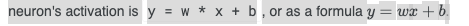
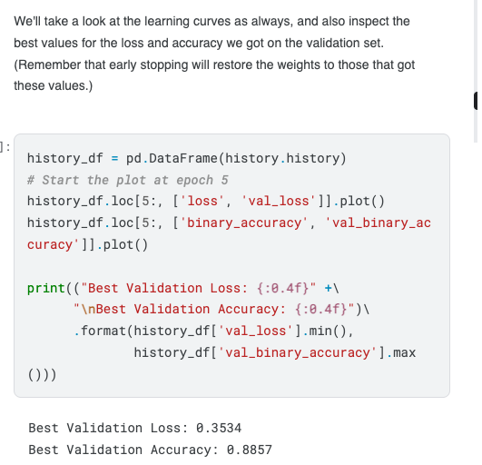

# Entrada 08 — Resumen del segundo IRAT~~
~~

## Contexto
Realicé un resumen para el segundo IRAT del curso, donde se abordaron los fundamentos de **deep learning** y la estructura de las **redes neuronales artificiales**.  
Este trabajo me permitió entender de forma visual y práctica cómo una red neuronal aprende a partir de la combinación de pesos, bias y funciones de activación, y por qué estas redes son capaces de modelar relaciones no lineales.

## Objetivos
- Comprender el concepto de *deep learning* como subcampo del *machine learning*.  
- Entender la estructura de una red neuronal: neuronas, pesos, bias, y capas.  
- Comprender el funcionamiento de las funciones de activación y su rol en la no linealidad.  
- Analizar la función de pérdida (*loss function*) y las curvas de aprendizaje (*learning curves*).  
- Conocer técnicas de regularización como *dropout* para evitar el *overfitting*.  

## Actividades (con tiempos estimados)
- Lectura y análisis del material teórico — 1 hora  
- Elaboración del resumen con esquemas e imágenes — 1 hora y media  
- Revisión conceptual y redacción final — 30 min  

## Desarrollo

**What is deep learning?**  
Deep learning is an approach to machine learning characterized by deep stacks of computations.

---

### Neural Networks
Through their power and scalability neural networks have become the defining model of deep learning. Neural networks are composed of neurons, where each neuron individually performs only a simple computation.   

El poder de una neural network, viene de la complejidad de las conexiones que pueden construir los neurones que la conforman.

---

### Neuron

**X = input**  
**W = Peso de la conexión con el neuron.**

Cuando un valor pasa atravéz de la conexión, se multiplica ese valor por el peso de la conexión.  
Por ejemplo para X que llegó al neurólogo, es W * X.  

Una neural network “aprende” modificando sus pesos.  
**B = Bias**

**Y = Output del neuron.**  
Para obtener el output, suma todos los valores que recibe de sus conexions.  

  
= Ecuación de la recta en el plano cartesiano.

---

### Ejemplo: La unidad linear como modelo

---

### Multiple Inputs

Una unidad con dos inputs va a ajustarse a un plano,  
Mientras que una unidad con mas de dos inputs se va a ajustar a un hyperplano.

---

### Layers
Neural Networks tipicamente organizan sus neuronas en layers, cuando recolectamos linear units las cuales tienen un set común de inputs, obtenemos un dense layer.

**1 = bias**, en realidad entiendo que no tiene valor, pero entiendo que le da ese peso para no modificar la ecuación y por lo tanto el output.

---

### Función de Activación

Es una funcion que se le aplica a los outputs de los layers, para que podamos salir de la “recta”, y alcanzar la “curva”.  
Sin las funciones de activación, las neural networks solo podrían aprender relaciones lineales.

---

### Rectifier Function

---

### The Loss Function

## Reflexión
Este IRAT me permitió comprender de manera más profunda cómo las redes neuronales aprenden y por qué el *deep learning* representa un salto frente al *machine learning* tradicional.  
Entendí la importancia de las funciones de activación y del proceso de backpropagation en la optimización de los pesos.  
También pude visualizar cómo las curvas de aprendizaje ayudan a diagnosticar el rendimiento de un modelo y la utilidad de técnicas como *dropout* para evitar el sobreajuste.  
En general, siento que logré afianzar los conceptos esenciales que serán la base para los próximos temas de redes convolucionales y modelos más complejos.

## Próximos pasos
Procedí a realizar la **Tarea 1 de la UT2**, donde comenzamos a aplicar redes neuronales en problemas más concretos y a analizar su comportamiento en datasets reales.
