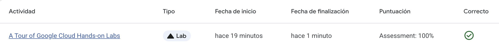

# Entrada — Google Cloud Skills Boost: Primer Lab en GCP  
~~

## Contexto
Este lab forma parte de los ejercicios introductorios de Google Cloud Skills Boost, orientados a familiarizarse con la consola de GCP, su estructura de proyectos, permisos, APIs y servicios disponibles. Es la puerta de ingreso para quienes comienzan en computación en la nube

El propósito fue tener un primer contacto práctico con GCP, entender cómo se organizan proyectos, cómo se gestionan roles y permisos, y cómo se habilitan APIs y servicios — elementos fundamentales para cualquier arquitectura en la nube.

## Objetivos
- Acceder a la consola de GCP usando credenciales provisionales. 
- Visualizar y comprender la estructura de proyectos en GCP. 
- Revisar y modificar roles y permisos vía Cloud IAM. 
- Explorar la biblioteca de APIs/servicios y habilitar algunos servicios básicos.  

## Actividades (con tiempos estimados)
- Inicio del lab y acceso a consola — 5 min  
- Navegación de proyectos disponibles y descripción de uno — 10 min  
- Acceso a IAM, revisión de roles, otorgar permisos de viewer — 10 min  
- Exploración de APIs y servicios disponibles — 10 min  
- Finalización del lab y cierre de sesión — 5 min  

## Desarrollo
Al iniciar el lab obtuve credenciales temporales (usuario `student-xx-xxxxxx@qwiklabs.net` y contraseña asignada), lo que permitió acceder a un proyecto provisório en GCP sin usar cuentas personales.

Una vez dentro, exploré la vista de proyectos disponibles: confirmé el ID del proyecto asignado, su información básica y la lista de recursos del entorno. Luego accedí al panel de IAM & Admin, verifiqué los roles asignados (por defecto “Editor” en este tipo de lab) y experimenté otorgando un rol “Viewer” a otro usuario ficticio como práctica — lo que me permitió entender los controles de acceso y permisos mínimos necesarios para ciertos servicios.  

Posteriormente exploré la biblioteca de APIs/servicios de GCP. Verifiqué los servicios disponibles, e identifiqué cómo habilitar las APIs correspondientes desde el dashboard, para preparar entornos con distintos recursos en la nube. Finalmente, terminé el lab limpiando los recursos temporales, cerrando sesión y verificando que todo volviera a estado inicial como corresponde.  

## Evidencias

## Reflexión

Este primer acercamiento a GCP me permitió comprender cómo se estructura un entorno en la nube a nivel de proyecto, permisos y servicios. Aprendí:  

- Que los proyectos son entidades clave para organizar recursos, con un ID único que permite rastrear servicios y permisos dentro de GCP.  
- Que el control de acceso mediante Cloud IAM es fundamental para garantizar seguridad y control sobre quién puede crear/modificar recursos — ideal para ambientes compartidos o producción.  
- Que habilitar servicios/APIs no es automático: hay que entender qué necesita cada proyecto, seleccionar qué APIs se van a usar y activar solo las necesarias.  

Además, trabajar con credenciales temporales me dio confianza para experimentar sin afectar entornos personales o corporativos, ideal para aprender.  

Este lab refuerza la importancia de una base sólida en gestión de infraestructura cuando se trabaja con cloud, antes de pasar a temas más avanzados (VMs, redes, funciones, storage, etc.).  

## Próximos pasos
- Procedi a realizar el Google Cloud Skills Boost Vertex AI Pipelines Lab.
